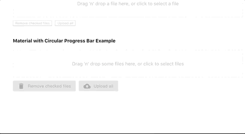

# react-firebase-image-upload-control

A image uploader for react that uploads images firebase storage.




## Installation
Run `yarn add react-firebase-image-upload-control` or `npm i react-firebase-image-upload-control --save-prod` to install the package in your app. 


## Prerequisites
You will need **react**, **react-dom** and **firebase** installed in your app.  They are listed as peer depenencies only for this package, so installing the package will _not_ automatically install those packages in your app.

Make sure you have initialized firebase somewhere in your app using your Firbase project's JSON file, e.g.:

```jsx
import firebase from "firebase";

const config = {
  apiKey: "<API_KEY>",
  authDomain: "<PROJECT_ID>.firebaseapp.com",
  databaseURL: "https://<DATABASE_NAME>.firebaseio.com",
  storageBucket: "<BUCKET>.appspot.com"
};
const firebaseApp = firebase.initializeApp(config);
```
You can copy your firebase-config.json file down from your Firebase project.  See [Google's instructions on how download your config file](https://support.google.com/firebase/answer/7015592?hl=en#web); (you want the "web app" file).   Your project must be enabled for [Cloud Storage](https://firebase.google.com/docs/storage/web/start), in which case it will have the **storageBucket** property shown in the example apbove.

You will need to have logged into your Firebase project in your app before attempting to use the control.   I use [react-with-firebase-auth](https://github.com/armand1m/react-with-firebase-auth) for that purpose in my example app.


## Props

- `firebaseApp` (required) - A reference to your Firebase app that was initialsed with a call such as `firebase.initializeApp(firebaseConfigObj)`
- `storageFolder` (required) - The target folder in Firebase storage.
- `disabled` (optional) - A boolean to display the control in a disabled state.  Defaults to `false`
- `multiple` - A boolean to specify the control will accept multiple images.  Defaults to false, i.e. the control handles only one image.
- `progressControl` (optional) - A React component that you can use to show upload progress as percentage.   The control must take a `value` prop, which is a number between 0 and 100.   I use react-circular-progressbar for this in my example code.  If not specified, the upload percentage will displayed as plain text.
- `checkboxControl` (optional) - A React control to display checkboxes next to each image preview, e.g. `@material-ui/core/Checkbox`.  If not supplied, plain HTML checkboxes are used, i.e `<input type="checkbox">`.
- `buttonControl` (optional) - A React control to display buttons for **Upload all** and **Remove checked files** buttons, e.g `@material-ui/core/Button`.  If not supplied, plain HTML buttons are used.
- `uploadButtonIcon` (optional) - If `buttonControl` is supplied then this React icon component will be display on the **Upload all** button.  E.g. `@material-ui/icons/CloudUpload`.
- `removeButtonIcon` (optional) - If `buttonControl` is supplied then this React icon component will be display on the **Remove checked files** button.  E.g. `@material-ui/icons/Delete`.
- `uploadStartCallback` (optional) - Function that is called when the Upload button on the control is clicked.  This passes back one parameter, which is an array of all the files about to be uploaded.
- `uploadCompleteCallback` (optional) - Function that is called when all uploads have completed.  This passes back one parameter, which is an object of info on the files that were uploaded.  The object has a `files` property, which is an array of all the files uploaded.  Each member of the `files` array is an object of File info, plus a `downloadUrl` property, which you can use to add the uploaded file to an HTML page as an `` tag.
- `options` (optional) - Use to pass additional styles to the control via the `styles` property.   The `styles` property had thee sub properties, which are:
  - `imgPreview`: styles passed directly to the preview images
  - `impPreviewLabel`: styles passed to the labels of the preview images
  - `progressControlWrapper`: if you're passing a `progressControl` prop, then that prop will be automatically wrapped inside a `<div>` tag by the control.  The `progressControlWrapper` styles will be passed to that wrapper.


## Example

```jsx
// Example code created with Create React App
import React, { useState } from "react";
import "./App.css";
import * as firebase from "firebase/app";
import "firebase/auth";
import "firebase/database";
import "firebase/storage";
import withFirebaseAuth from "react-with-firebase-auth";
import Checkbox from "@material-ui/core/Checkbox";
import Button from "@material-ui/core/Button";
import CloudUploadIcon from "@material-ui/icons/CloudUpload";
import DeleteIcon from "@material-ui/icons/Delete";

import { CircularProgressbar } from "react-circular-progressbar";
import "react-circular-progressbar/dist/styles.css";

import ReactFirebaseImageUploader from "./package";
import Login from "./Login";

// You must supply the Firebase config obj.  Download it from your Firebase project page
import firebaseConfigObj from "./firebaseconfig/firebase-config.json";
const firebaseApp = firebase.initializeApp(firebaseConfigObj);
const firebaseAppAuth = firebaseApp.auth();

const providers = {
  googleProvider: new firebase.auth.GoogleAuthProvider(),
  githubProvider: new firebase.auth.GithubAuthProvider(),
  twitterProvider: new firebase.auth.TwitterAuthProvider(),
  facebookProvider: new firebase.auth.FacebookAuthProvider()
};

const App = props => {
  const { user } = props;

  return (
    <div className="App">
      <h1>React Firebase Image Uploader Test</h1>
      <Login {...props} />
      <div style={{ marginTop: 40 }}>
        {user ? (
          <>
            <div>
              <h4>Vanilla Example</h4>
              <ReactFirebaseImageUploader
                firebaseApp={firebaseApp}
                storageFolder="rfiu-test"
                multiple
              />
            </div>
            <div style={{ marginTop: "40px" }}>
              <h4>Material with Circular Progress Bar Example</h4>
              <ReactFirebaseImageUploader
                firebaseApp={firebaseApp}
                storageFolder="rfiu-test"
                progressControl={CircularProgressbar}
                checkboxControl={Checkbox}
                buttonControl={Button}
                uploadButtonIcon={CloudUploadIcon}
                removeButtonIcon={DeleteIcon}
                options={{
                  styles: {
                    imgPreview: { maxWidth: "50px" },
                    imgPreviewLabel: { fontSize: "12px" },
                    progressControlWrapper: { height: "40px", width: "40px" }
                  }
                }}
                uploadCompleteCallback={statusObj => {
                  console.log("uploadCompleteCallback triggered, and we're done!, statusObj", statusObj);
                }}
                multiple
              />
            </div>
          </>
        ) : (
          <div>Login to upload images</div>
        )}
      </div>
    </div>
  );
};

export default withFirebaseAuth({
  providers,
  firebaseAppAuth
})(App);
```


## Contributing
You're a Dev and you want implement a fix or add a feature?  Read [the instructions on how to contribute to the this package](CONTRIBUTING.md).


## Changes
Read the [change log](CHANGELOG.md).


## Acknowledges
This package is really just a stiching together of two other projects, [react-firebase-file-uploader](https://github.com/fris-fruitig/react-firebase-file-uploader) and [react-dropzone](https://github.com/react-dropzone/react-dropzone).